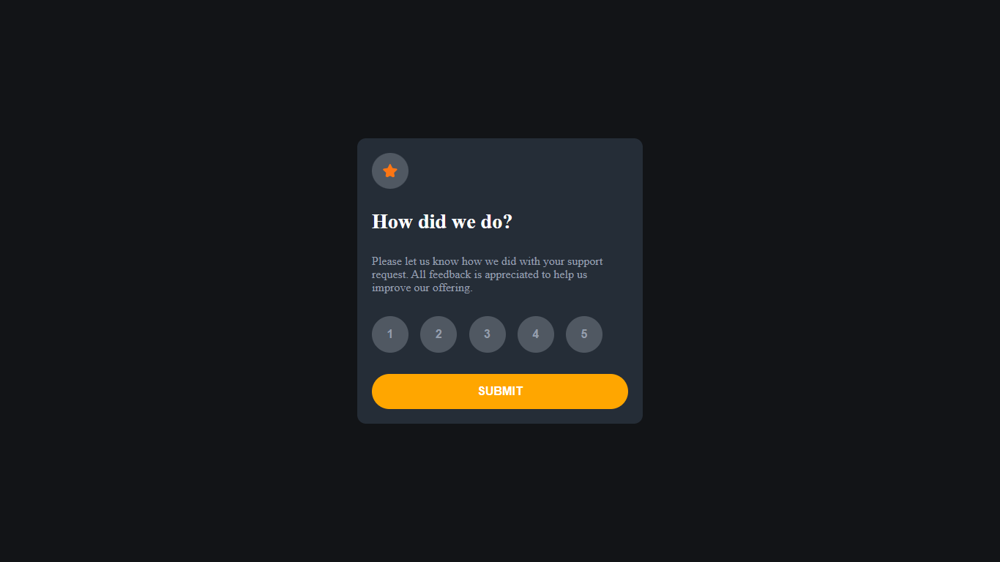

# Frontend Mentor - Interactive rating component solution

This is a solution to the [Interactive rating component challenge on Frontend Mentor](https://www.frontendmentor.io/challenges/interactive-rating-component-koxpeBUmI). Frontend Mentor challenges help you improve your coding skills by building realistic projects. 

## Table of contents

- [Overview](#overview)
  - [The challenge](#the-challenge)
  - [Screenshot](#screenshot)
  - [Links](#links)
- [My process](#my-process)
  - [Built with](#built-with)
  - [Useful resources](#useful-resources)
- [Author](#author)

## Overview

### The challenge

Users are able to:

- View the optimal layout for the app depending on their device's screen size
- See hover states for all interactive elements on the page
- Select and submit a number rating
- See the "Thank you" card state after submitting a rating

### Screenshot

### Links

- Solution URL: [interactive-rating-component](https://github.com/felixateya/interactive-rating-component)
- Live Site URL: [interactive-rating-component](https://interactive-rating-component-beta-lemon.vercel.app/)

## My process

### Built with

- [Vite](https://reactjs.dev/) - JS library

### Useful resources

- [vite](https://vitejs.dev) - This helped me for XYZ reason. I really liked this pattern and will use it going forward.

## Author

- Website - [felix ateya](https://mulaafelix.vercel.app)
- Frontend Mentor - [@felixateya](https://www.frontendmentor.io/profile/felixateya)
- Twitter - [@felixateya](https://www.twitter.com/shaft_kunta)

